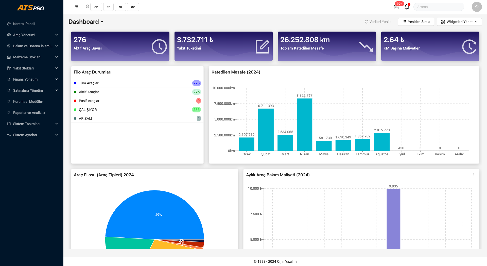
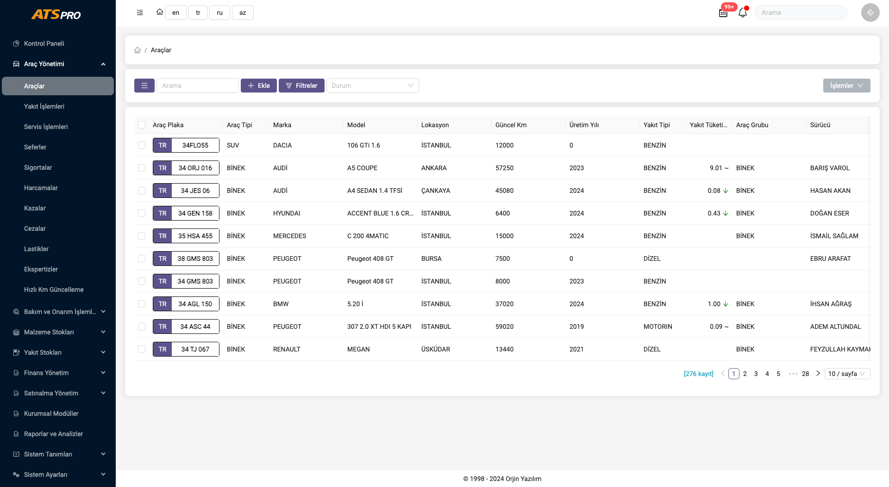
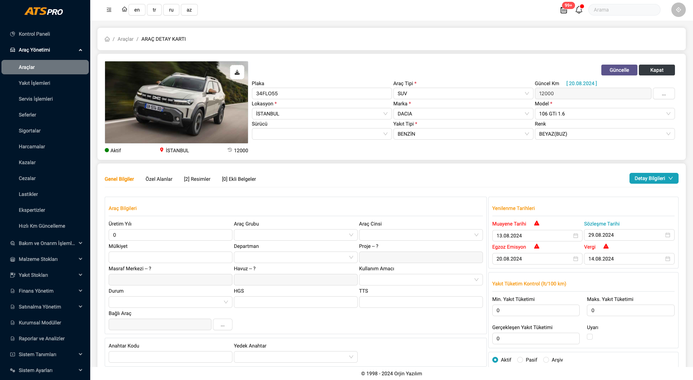
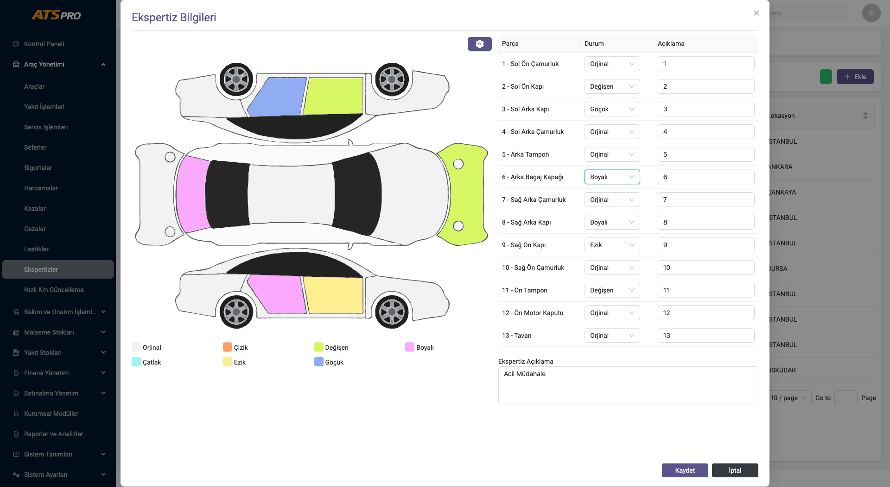

# ATS Pro - Aplicación de Gestión de Flotas

## Descripción General

ATS Pro es una aplicación de gestión de flotas desarrollada utilizando React para el frontend y una API RESTful para la comunicación con el backend. La interfaz de usuario (UI) está construida con Ant Design, lo que proporciona un aspecto limpio y moderno.

## Características

- **Gestión de Flotas**: Administre vehículos, conductores y programas de mantenimiento de manera eficiente.
- **Seguimiento en Tiempo Real**: Rastree la ubicación y el estado de su flota en tiempo real.
- **Informes y Análisis**: Genere informes detallados sobre el rendimiento de la flota y los costos de mantenimiento.
- **Gestión de Usuarios**: Control de acceso basado en roles para diferentes niveles de usuarios.
## Capturas de Pantalla

A continuación se muestran algunas capturas de pantalla de la aplicación:

### Panel de Control



### Gestión de Flotas




### Informes Especializados



## Instalación

1. Clonar el repositorio:
    ```bash
    git clone https://github.com/yourusername/ats-pro.git
    cd ats-pro
    ```

2. Instalar las dependencias:
    ```bash
    npm install
    ```

3. Iniciar el servidor de desarrollo:
    ```bash
    npm start
    ```


## Tecnologías Utilizadas

- **React**: Biblioteca de frontend para crear interfaces de usuario.
- **Ant Design**: Framework de interfaz de usuario para un aspecto limpio y profesional.
- **API RESTful**: Para la comunicación con el backend.

## Contribuciones

¡Las contribuciones son bienvenidas! Por favor, bifurque el repositorio y envíe una solicitud de extracción (pull request).

## Licencia

Este proyecto está licenciado bajo la Licencia MIT - consulte el archivo [LICENSE](LICENSE) para obtener más detalles.

## Contacto

Si tiene alguna pregunta o sugerencia, no dude en contactarme en [your.email@example.com](mailto:your.email@example.com).
